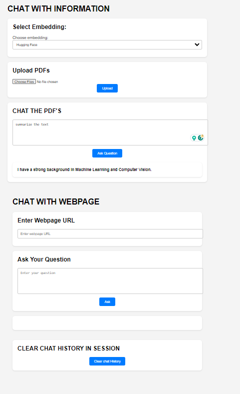

## CHAT WITH PDF AND WEBPAGES

This project is created on the showing on completing the learning objectives of the course on LL by Andrew Ng / Deep learning.ai

The link to the course is : [Course URL](https://learn.deeplearning.ai/langchain)

### The following is the breakdown of the components of the project.

1. Gettting all the text from the pdf or webpage.
2. Conversion of text into chunks
3. Creating a vector store which is representing the embeddings of the chunks
4. Creating the conversation chain with memory in that flask application session.
5. Creating a UI with HTML and CSS and linking it with the flask backend.

### Application visual appearance

1. The top section shows an option to select hugging face or openai embeddings
2. Second option to upload multiple pdf's
3. To read data from the webpage.
4. To delete previous chat history session in the flask application so it won't be fed to LLM in the future queries.

### Requirements

- Python 3.8.16 version
- cd flask_application
- python app.py

The library packages are present inside requirements.txt. They can be installed using.
- pip install -r requirements.txt

- please update your own personal keys in the .env file
    - OPEN AI API KEY
    - HUGGING FACE API KEY

